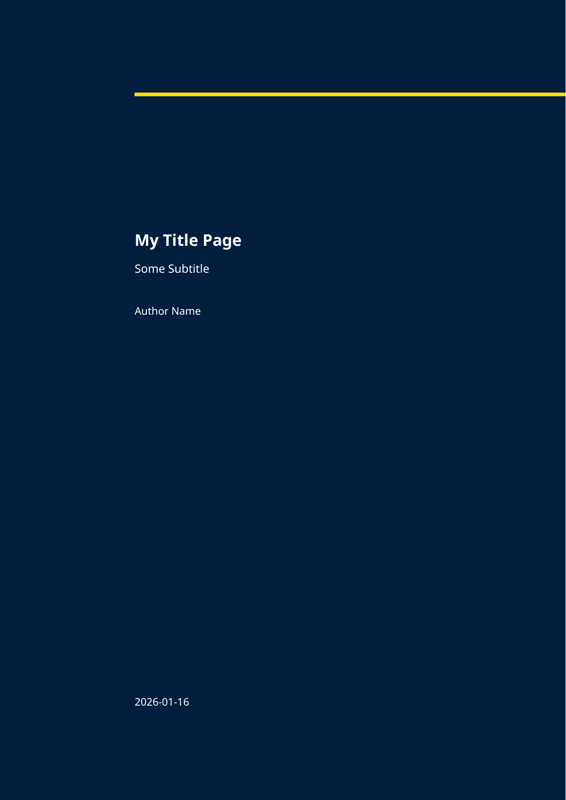
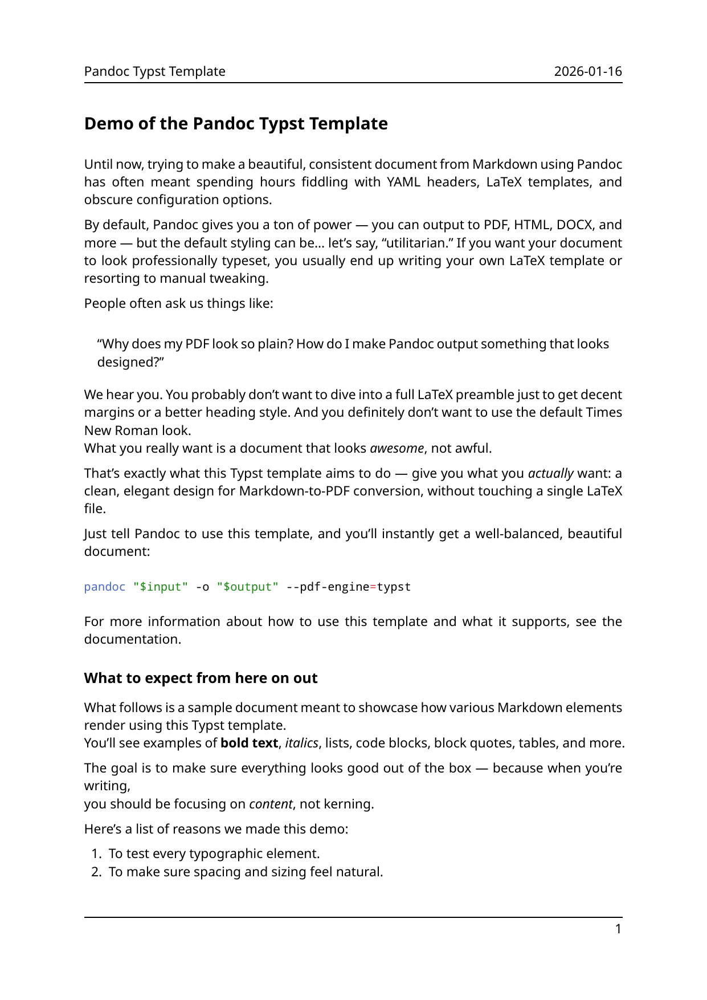
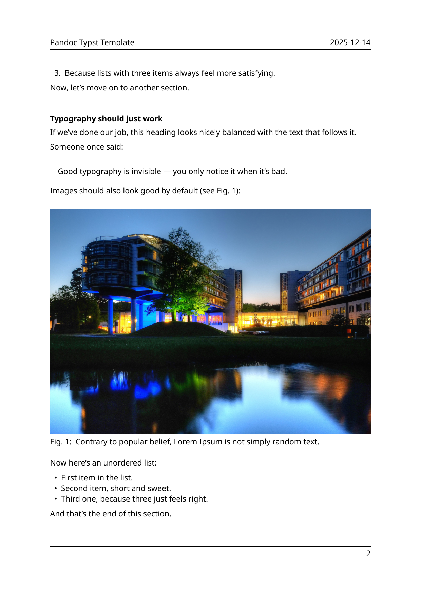
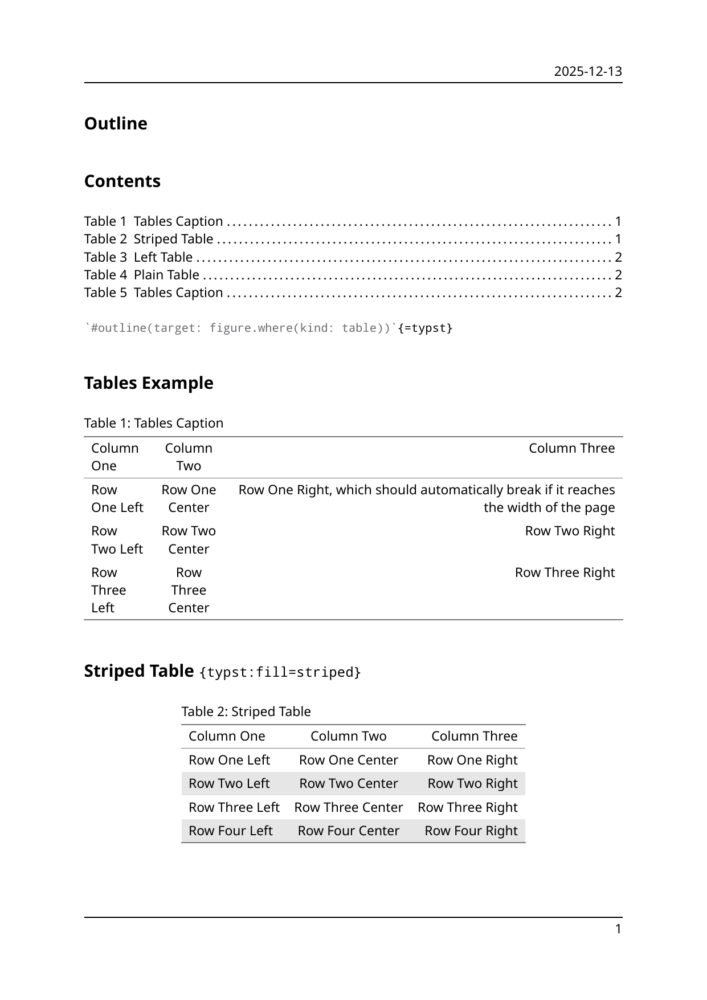
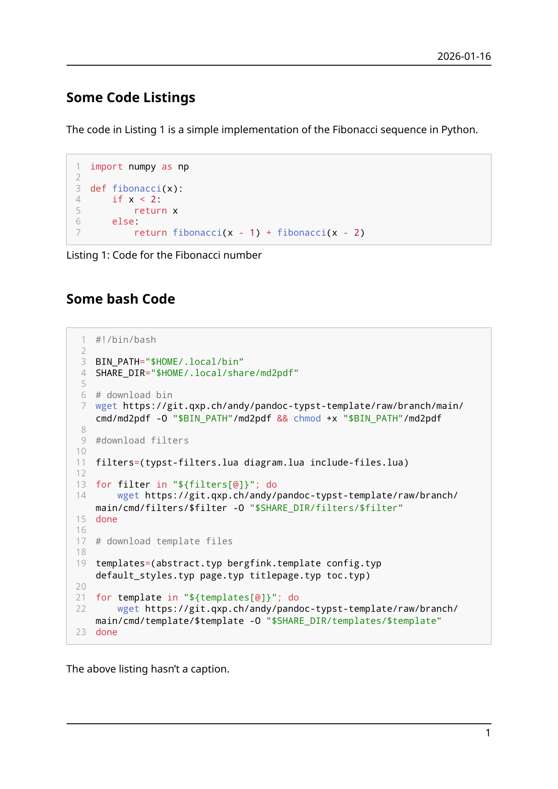
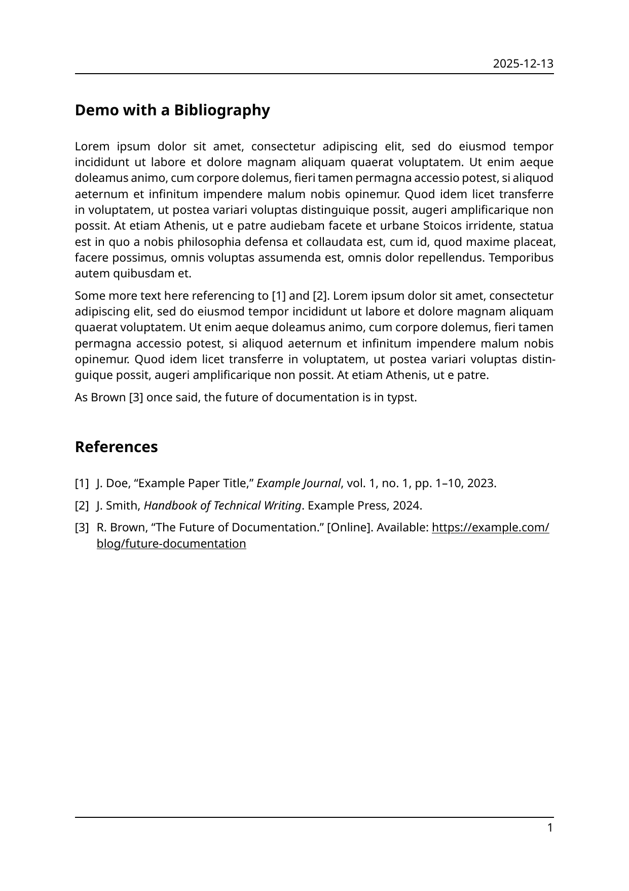
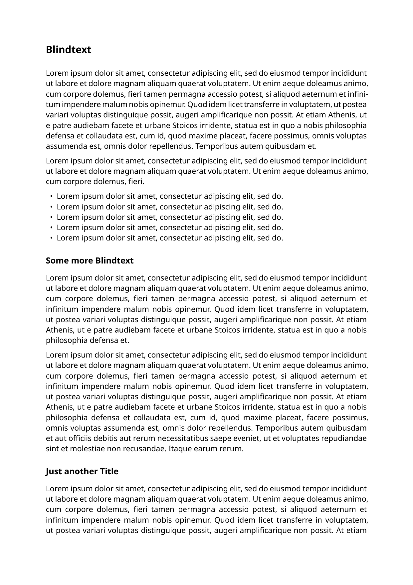
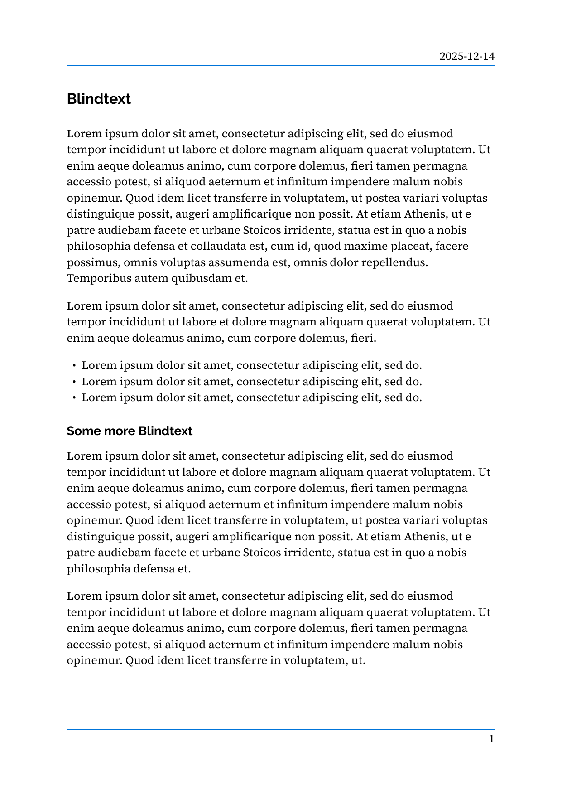
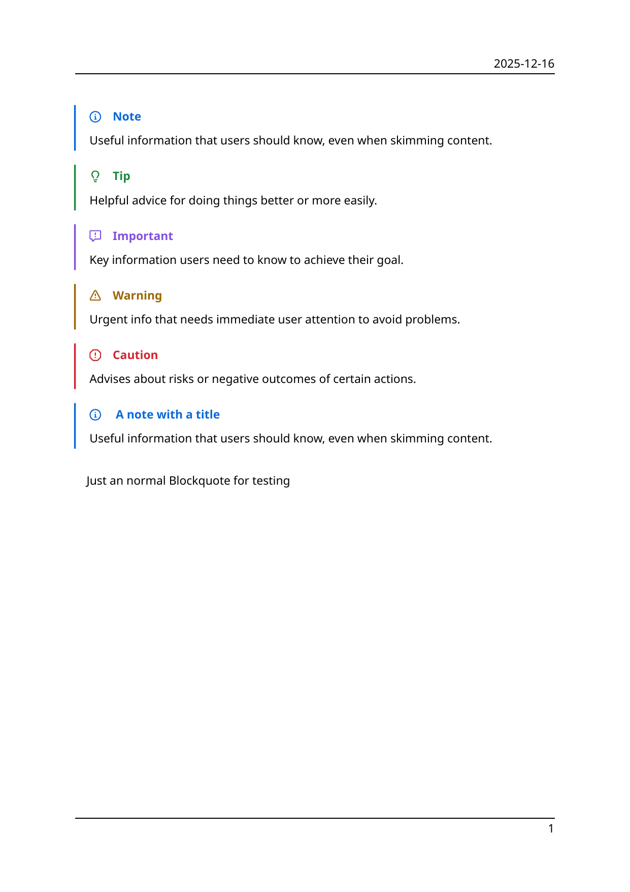
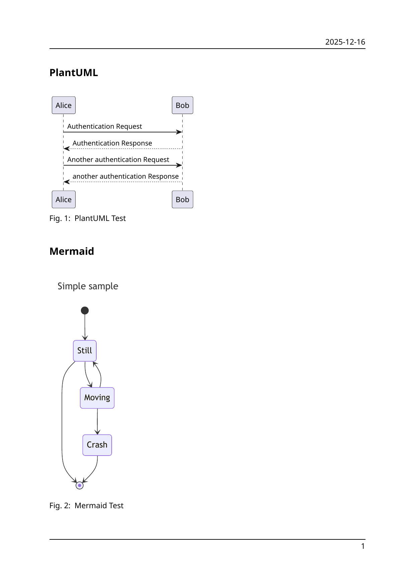

# Bergfink

A template for Pandoc to generate PDFs with typst.
This template is based on the [Eisvogel template](https://github.com/Wandmalfarbe/pandoc-latex-template).

## Install (Linux)

```bash
curl https://git.qxp.ch/andy/pandoc-typst-template/raw/branch/main/install.sh | bash
```

This installs the template and filters to `$HOME/.local/share/md2pdf` and the `md2pdf` command to `$HOME/.local/bin/`.
To convert a Markdown file use `md2pdf mydocument.md`. The output is saved as `mydocument.pdf`.

Save the `config.typ` from [here](https://git.qxp.ch/andy/pandoc-typst-template/raw/branch/main/cmd/template/config.typ) to `$HOME/.local/share/md2pdf`. Adjust the variables to change the defaults.

| Custom title page                               | Basic example page                                  |
| ----------------------------------------------- | --------------------------------------------------- |
|  |  |

# Included Lua Filters

## Diagrams

Renders diagrams using [Mermaid](https://mermaid.js.org/), [PlantUML](https://plantuml.com/) or [Pikchr](https://pikchr.org/).
You need to have `mmdc`, `plantuml` and [`pikchr-cli`]() in your `PATH` to use them.

## Template Variables

| **Setting**                 | **Default Value**                               | **Description**                                             |
| --------------------------- | ----------------------------------------------- | ----------------------------------------------------------- |
| `date`                      | `datetime.today()`                              | The date shown in the header and title page.                |
| `dateformat`                | `"[year]-[month]-[day]"`                        | The date format used in the header and title page.          |
| `lang`                      | `"en"`                                          | Sets the language of the document.                          |
| `region`                    | `"US"`                                          | Sets the regional format (e.g., for dates, numbers).        |
| `paper`                     | `"a4"`                                          | Sets the paper size.                                        |
| `font`                      | `("noto sans", "arial")`                        | Sets the main font family.                                  |
| `heading-font`              | Same as `font`                                  | Sets the font family for headings.                          |
| `code-font`                 | `("noto mono", "courier")`                      | Sets the font family for code.                              |
| `fontsize`                  | `11pt`                                          | Sets the main font size.                                    |
| `leading`                   | `0.65em`                                        | Sets the paragraph line spacing.                            |
| `spacing`                   | `1.2em`                                         | Sets the spacing between paragraph.                         |
| `justify`                   | `true`                                          | Justifies paragraph text unless `no-justify` is set.        |
| `no-justify`                | `false`                                         | Disables text justification when set to `true`.             |
| `margin`                    | `(x: 2.5cm, y: 3.5cm)`                          | Sets page margins.                                          |
| `disable-header-and-footer` | `false`                                         | Removes header and footer when `true`.                      |
| `header-and-footer-stroke`  | `1pt + black`                                   | Sets the header and footer stroke.                          |
| `page-numbering`            | `"1"`                                           | Sets the page numbering style (e.g., `"1"`, `"1 / n"`).     |
| `authors`                   | `((name: "", email: "", affiliation: ""),)`     | List of authors with their info.                            |
| `author`                    | same as `authors`                               | Alternate author definition input.                          |
| `title`                     | `none`                                          | The document title.                                         |
| `subtitle`                  | `none`                                          | The document subtitle.                                      |
| `supervisor`                | `""`                                            | The supervisor’s name.                                      |
| `keywords`                  | `""`                                            | Document keywords (comma-separated).                        |
| `titlepage`                 | `false`                                         | Enables title page when `true`.                             |
| `titlepage-rule`            | `2.5pt + black`                                 | Sets the title page rule style.                             |
| `titlepage-bg`              | `white`                                         | Sets the background color for the title page.               |
| `titlepage-fg`              | `black`                                         | Sets the foreground color for the title page.               |
| `titlepage-logo`            | `none`                                          | If set, the image at the path is shown on the bottom right. |
| `titlepage-logo-width`      | `12em`                                          | Sets the title page logo width.                             |
| `toc`                       | `false`                                         | Inserts a table of contents.                                |
| `toc-depth`                 | `none`                                          | Sets table of contents depth.                               |
| `toc-own-page`              | `false`                                         | Places the TOC on its own page when `true`.                 |
| `lof`                       | `false`                                         | Inserts a list of figures.                                  |
| `lof-title`                 | `"List of Figures"`                             | Title for the list of figures.                              |
| `lot`                       | `false`                                         | Inserts a list of tables.                                   |
| `lot-title`                 | `"List of Tables"`                              | Title for the list of tables.                               |
| `listings`                  | `false`                                         | Enables styled code blocks with line numbers.               |
| `columns`                   | `1`                                             | Sets the number of text columns.                            |
| `number-sections`           | `false`                                         | Enables numbered section headings.                          |
| `section-numbering`         | `"1.1.1.1.1"`                                   | Defines section numbering style.                            |
| `figure-prefix`             | `"Fig."`                                        | Prefix label for figures.                                   |
| `table-prefix`              | `"Table"`                                       | Prefix label for tables.                                    |
| `listing-prefix`            | `"Listing"`                                     | Prefix label for code listings.                             |
| `header-left`               | `cfg.at("title", default: none)`                | Left-aligned header content (default is title).             |
| `header-center`             | `none`                                          | Centered header content.                                    |
| `header-right`              | `cfg.at("date", default: datetime.today())`     | Right-aligned header content (default is formatted date).   |
| `footer-left`               | `authors.map(author => author.name).join(", ")` | Left footer (default is author names).                      |
| `footer-center`             | `none`                                          | Center footer content.                                      |
| `footer-right`              | `counter(page).display("1")`                    | Right footer (default shows page number).                   |
| `abstract-title`            | `""`                                            | Title of the abstract section.                              |
| `abstract`                  | `""`                                            | Content of the abstract.                                    |
| `thanks-title`              | `""`                                            | Title of the acknowledgments section.                       |
| `thanks`                    | `""`                                            | Content of the acknowledgments section.                     |
| `glossy`                    | `none`                                          | Path to a YAML file with the glossary.                      |
| `smart`                     | `true`                                          | Enables smart quotes.                                       |
| `equation-numbering`        | `none`                                          | Controls equation numbering style.                          |
| `header-includes`           | `[]`                                            | Additional Typst or Markdown code to include in the header. |
| `include-before`            | `[]`                                            | Content included before the main document body.             |
| `include-after`             | `[]`                                            | Content included after the main document body.              |

## More Images

| Image                                          | Tables                                   |
| ---------------------------------------------- | ---------------------------------------- |
|  |  |

| Code Listing                                          | Bibliography                                         |
| ----------------------------------------------------- | ---------------------------------------------------- |
|  |  |

| No header and footers                                             | No text justify and custom header and footer strokes  |
| ----------------------------------------------------------------- | ----------------------------------------------------- |
|  |  |

| Alerts                                   | Diagrams                                     |
| ---------------------------------------- | -------------------------------------------- |
|  |  |
