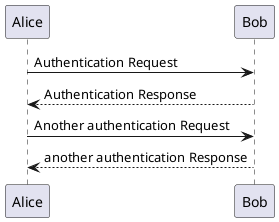

# PlantUML

This text should link to @plantuml-test.




# Mermaid

```{.mermaid caption="Mermaid Test" align=left}
---
title: Simple sample
---
stateDiagram-v2
    [*] --> Still
    Still --> [*]

    Still --> Moving
    Moving --> Still
    Moving --> Crash
    Crash --> [*]

```

# Pikchr

```pikchr {caption="Pikchr Test"}
   arrow right 200% "Markdown" "Source"
   box rad 10px "Markdown" "Formatter" "(markdown.c)" fit
   arrow right 200% "HTML+SVG" "Output"
   arrow <-> down 70% from last box.s
   box same "Pikchr" "Formatter" "(pikchr.c)" fit
```
