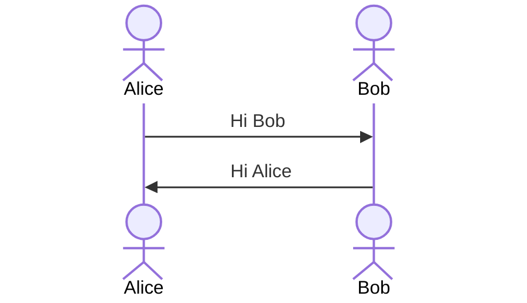

# Feature Showcase

This document demonstrates some of the features available in the Typst template.

## Text Formatting

Basic formatting includes **bold**, _italic_, and **_bold italic_** text. You can also use ~~strikethrough~~ and `inline code`.

## Headings

### Level 3 Heading

#### Level 4 Heading

##### Level 5 Heading

###### Level 6 Heading

## Lists

### Unordered Lists

- Item 1
- Item 2
  - Nested item 2.1
  - Nested item 2.2
- Item 3

### Ordered Lists

1. First item
2. Second item
   1. Nested item 2.1
   2. Nested item 2.2
3. Third item

### Definition Lists

Term 1
: Definition 1

Term 2
: Definition 2.1
: Definition 2.2

## Tables {#tables}

| Feature | Description                 | Support |
| ------: | :-------------------------- | :-----: |
|  Tables | Basic tables with alignment |    ✓    |
|   Lists | Ordered and unordered lists |    ✓    |
|    Code | Syntax highlighting         |    ✓    |

: {typst:fill=striped}

## Code Blocks

```python
def hello_world():
    print("Hello, World!")
```

```typescript
function greet(name: string): void {
  console.log(`Hello, ${name}!`);
}
```

## Blockquotes

> This is a blockquote.
> It can span multiple lines.
>
> > And it can be nested.

## Images

Here's an example image:

{ width=75% }

## Mathematical Equations

Inline math: $E = mc^2$

Display math:

$$
\int_{a}^{b} x^2 dx = \left[\frac{x^3}{3}\right]_{a}^{b}
$$

<formula-one>

This is a reference to @formula-one

## Cross-references

See [Section Tables](#tables) for more information.

## Abbreviations

The HTML{.abbr title="HyperText Markup Language"} specification is maintained by the W3C{.abbr title="World Wide Web Consortium"}.

## Footnotes

Here's a sentence with a footnote[^1].

[^1]: This is the footnote content.

## Horizontal Rule

---

## Custom Divs

::: {.warning}
This is a warning message styled with custom CSS.
:::

::: {.note}
This is a note message styled differently.
:::

## Mermaid Code



## Grid Table

+-------------------------+
| **Percentages** |
+:=================:+====:+
| Fortyfive | 45% |
+-------------------+-----+
| Twenty | 20% |
+-------------------+-----+
| Thirtyfive | 35% |
+-------------------+-----+
: {align=left}
